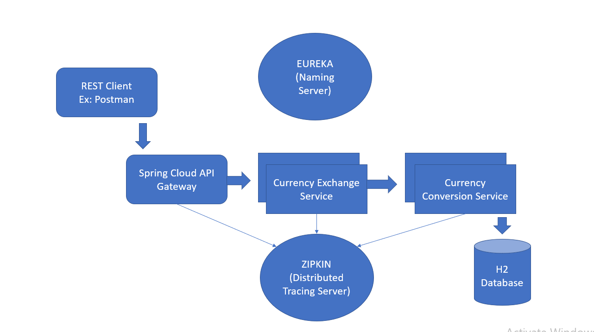
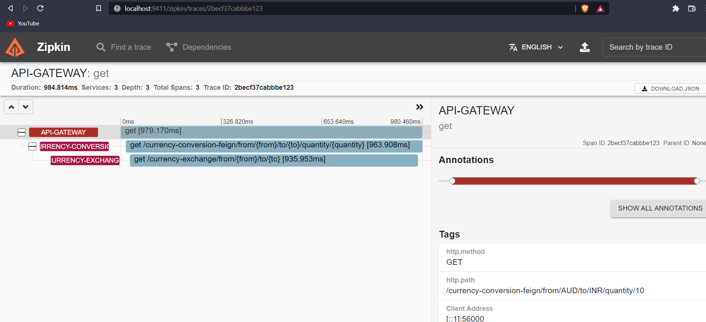

# Java Microservices using Spring-Boot

**services :**

| service | url |  
|--|--| 
|Eureka  |  localhost:8761|
|spring-cloud-api-gateway  | localhost:8765 |
|spring-cloud-config-server  | localhost:8888 |
| currency conversion service | localhost:8100,8101... |
|currency exchange service|localhost: 8000, 8001....|
|  |  |

**Flow-diagram**

**Zipkin**

**dependencies used :**
~~~~
	* spring-boot-starter-web
	* spring-boot-starter-data-jpa
	* spring-cloud-starter-config
	* spring-cloud-starter-actuator
	* spring-cloud-starter-sleuth
	* spring-cloud-starter-zipkin
	* spring-cloud-starter-openfeign
	* spring-cloud-starter-netflix-eureka-client
	* spring-cloud-starter-netflix-eureka-server
	* spring-boot-starter-aop
	* spring-cloud-starter-circuitbreaker-resilience4j
	* spring-cloud-starter-gateway
	* spring-cloud-config-server
	* spring-boot-devtools
	* h2

~~~~

## To run zipkin server using docker

> docker run -p 9411:9411 --name zipkin openzipkin/zipkin

## To build docker images
cd in to the maven directory and run the following command.
> mvn spring-boot:build-image -DskipTests
